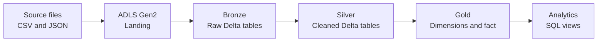
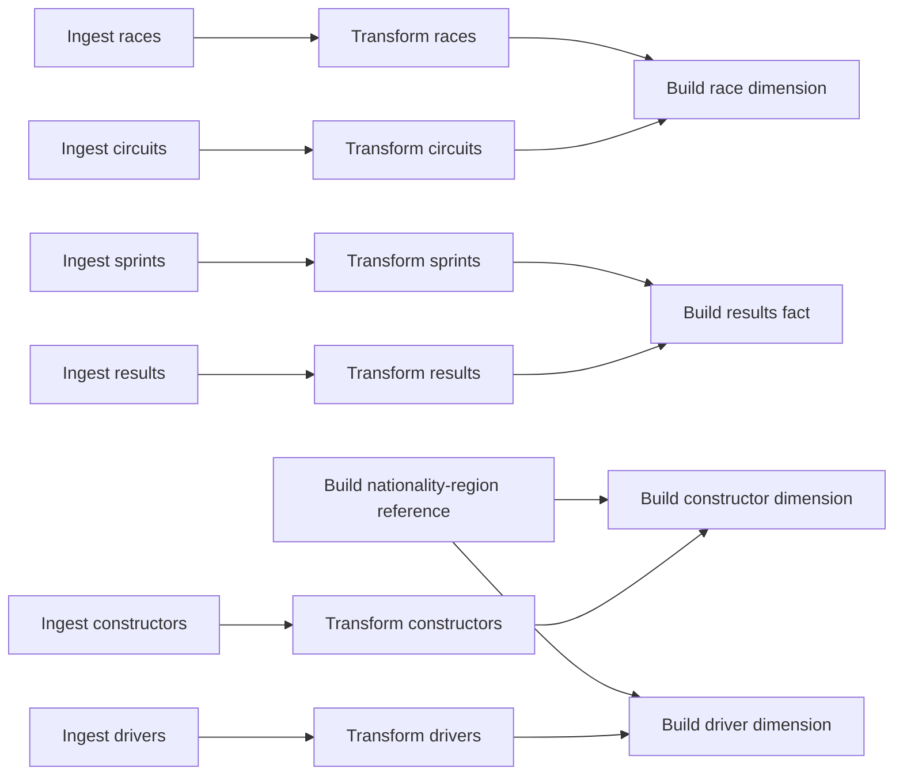

# Formula 1 Data Engineering

End-to-end batch data engineering project built with **Azure Databricks**, **Apache Spark**, **Delta Lake**, **Unity Catalog**, and **Azure Data Lake Storage Gen2**.

The project processes Formula 1 racing data through a medallion architecture, transforming source CSV and JSON files into governed Delta tables and an analytics-ready dimensional model for driver and constructor standings.

> This project was developed as part of the [Azure Databricks & Spark for Data Engineers: Hands-on Project](https://www.udemy.com/course/azure-databricks-spark-core-for-data-engineers/) course and adapted in a personal Azure Databricks environment.

## Project objectives

- Configure governed access to ADLS Gen2 through Unity Catalog.
- Ingest Formula 1 CSV and JSON datasets with explicit schemas.
- Add ingestion metadata and batch identifiers for traceability and auditing.
- Process source data incrementally through parameterized batches.
- Reprocess Bronze partitions idempotently with Delta Lake `replaceWhere`.
- Apply Delta Lake `MERGE` upserts in the Silver and Gold layers.
- Standardize, clean, and deduplicate data using PySpark.
- Store data as managed Delta tables across Bronze, Silver, and Gold layers.
- Build a dimensional model for analytical workloads.
- Produce SQL views for driver and constructor championship standings.
- Orchestrate the execution flow with a Databricks Lakeflow Job.

## Architecture



The source files are stored in an **external Unity Catalog volume**. Bronze, Silver, and Gold datasets are written as **managed Delta tables**, with storage locations governed by Unity Catalog.

## Data pipeline

### Landing

The landing layer preserves the original source files in ADLS Gen2 and exposes them to Databricks through the external volume:

```text
/Volumes/formula1/landing/files/<batch_id>
```

Each delivery is organized under a directory identified by `batch_id` (for example, `2025-01`). The same parameter is passed through the Lakeflow Job to every pipeline layer.

The project works with six source datasets:

| Dataset | Purpose |
| --- | --- |
| Circuits | Circuit names and geographical information |
| Races | Seasons, rounds, dates, and race information |
| Constructors | Formula 1 teams and nationalities |
| Drivers | Driver identity and biographical information |
| Results | Race results by driver and constructor |
| Sprints | Sprint session results |

### Bronze

The Bronze layer ingests the original CSV and JSON files into Delta tables. The ingestion notebooks:

- define explicit PySpark schemas;
- support single-file and folder-based ingestion;
- retain source-level attributes;
- add an ingestion timestamp;
- capture the source file path through Spark metadata;
- add the `batch_id` received from the job parameter;
- partition Delta tables by `batch_id`;
- use `replaceWhere` to overwrite only the partition being processed.

The reusable `add_ingestion_metadata` helper centralizes the audit columns applied during ingestion. The `write_to_bronze` helper makes batch reprocessing idempotent: rerunning the same `batch_id` replaces only that batch instead of duplicating it or overwriting the complete table.

### Silver

The Silver layer standardizes and validates the Bronze data by:

- selecting attributes required downstream;
- renaming columns to `snake_case`;
- normalizing text values;
- flattening nested structures;
- filtering invalid or incomplete records;
- removing duplicates using business keys;
- filtering the Bronze source by the current `batch_id`;
- persisting the results as Delta tables with reusable upsert logic.

On the first execution, each Silver dataset is created as a Delta table. Subsequent executions use Delta Lake `MERGE` operations based on the dataset business key. Matched records are updated only when the incoming batch is at least as recent as the stored batch, while new records are inserted.

### Gold

The Gold layer creates an analytics-ready dimensional model:

| Object | Type | Description |
| --- | --- | --- |
| `dim_races` | Dimension | Race and circuit attributes |
| `dim_constructors` | Dimension | Constructor and geographical region attributes |
| `dim_drivers` | Dimension | Driver and geographical region attributes |
| `fact_session_results` | Fact | Combined race and sprint session results |
| `ref_nationality_region` | Reference | Curated nationality-to-region mapping |

Gold notebooks process only the current batch and use Delta Lake `MERGE` operations to update existing dimension and fact records or insert new ones. Reusable helpers add `created_timestamp` and `updated_timestamp` audit fields.

The fact table combines race and sprint results and derives analytical flags such as:

- `is_win`;
- `is_podium`;
- `has_points`;
- `session_type`.

### Analytics

Spark SQL views aggregate the dimensional model to calculate seasonal standings:

- `v_driver_standing`: race starts, points, victories, podiums, and driver ranking;
- `v_constructor_standing`: race starts, points, victories, podiums, and constructor ranking.

Rankings are calculated with SQL window functions, partitioned by season.

## Gold data model


## Repository structure

```text
formula1-data-engineering/
├── 00-common/       # Shared environment configuration and helper functions
├── 01-setup/        # Unity Catalog, schemas, locations, and volume setup
├── 02-bronze/       # Source ingestion notebooks
├── 03-silver/       # Cleaning and standardization notebooks
├── 04-gold/         # Dimensional model and reference data
├── 05-analytics/    # Standings views and analytical SQL
└── z-course-images/ # Architecture and data model assets
```

## Technologies

- Azure Databricks
- Apache Spark
- PySpark
- Spark SQL
- Delta Lake
- Unity Catalog
- Azure Data Lake Storage Gen2
- Databricks Lakeflow Jobs
- Git and GitHub

## Execution order

1. Run the environment setup notebook in `01-setup`.
2. Upload each source delivery to a batch directory in the landing volume.
3. Define the `p_batch_id` parameter for the batch being processed.
4. Run the ingestion notebooks in `02-bronze`.
5. Run the transformation notebooks in `03-silver`.
6. Create the nationality-region reference and Gold model in `04-gold`.
7. Create the analytical views in `05-analytics`.
8. Query the standings views through Databricks SQL.

The operational workflow is orchestrated through a Lakeflow Job in the Databricks workspace. Its workspace configuration is not currently stored as code in this repository.

## Lakeflow Job orchestration

The workspace job runs independent ingestion branches in parallel and applies task dependencies before downstream transformations:



The Lakeflow Job receives `p_batch_id` as a job parameter and forwards it to the Bronze, Silver, and Gold notebook tasks. This dependency graph allows unrelated branches to run concurrently while ensuring that each Gold table starts only after all required upstream tables are available. The analytical views are created separately after the Gold model is ready.

## Prerequisites

To reproduce the project, you need:

- an Azure subscription;
- an Azure Databricks workspace with Unity Catalog enabled;
- an ADLS Gen2 storage account;
- a Databricks access connector or another supported Azure identity;
- a Unity Catalog storage credential with access to the target container;
- compute capable of running the project notebooks.

Cloud resource names and storage paths in the setup and configuration notebooks must be adapted to the target environment.

## Current implementation notes

- The pipeline uses incremental batch processing controlled by `p_batch_id`.
- Bronze tables are partitioned by `batch_id`; reprocessing uses `replaceWhere` to replace only the selected batch.
- Silver and Gold tables use Delta Lake `MERGE` for idempotent upserts based on business keys.
- The initial table creation uses overwrite mode only when the target table does not yet exist.
- Source files and generated datasets are not included in the repository.
- Cloud credentials and secrets must remain outside source control.
- Lakeflow Job configuration is maintained in the workspace and is not yet represented through a Declarative Automation Bundle.

## Possible next steps

- Parameterize environment-specific catalog and storage settings.
- Add automated data-quality checks.
- Version the Lakeflow Job with a Declarative Automation Bundle.
- Add unit and integration tests.
- Configure CI/CD for validation and deployment.

## Author

**Victor Moreno**

- GitHub: [@vicmarcondes](https://github.com/vicmarcondes)
